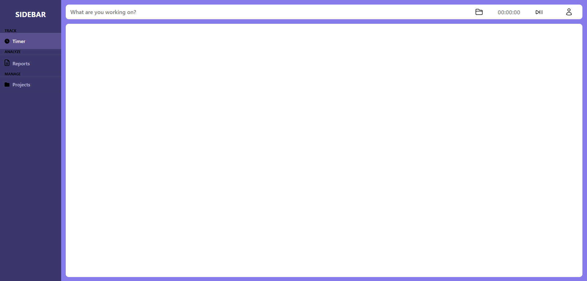

# Habit Tracker

## Overview

Welcome to **Your Habit Tracker**, a powerful tool to help you build positive habits and track your progress. Whether you're looking to boost productivity, improve health routines, or develop new skills, this habit tracker has you covered.

## Features

- **Intuitive Interface:** User-friendly design for seamless habit tracking.
- **Customizable Habits:** Tailor the tracker to your unique goals and routines.
- **Visual Progress:** Track your journey with insightful charts and statistics.
- **Multi-platform Support:** Access your habit data from anywhere, be it desktop or mobile.
- **Download Reports:** Go get your data inside spreadsheets if you want.

## Getting Started

### Prerequisites

Before you begin, ensure you have the following installed:

- Your dependencies
- Other requirements

### Installation

1. Clone the repository: `git clone https://github.com/ricardoiarced/habit-tracker.git`
2. Navigate to the project folder: `cd YourRepository`
3. Install dependencies: `npm install` or `yarn install`

### Usage

1. Run the application: `npm start`
2. Open your browser and go to [http://localhost:3000](http://localhost:3000)
3. Get started with habit tracking!
